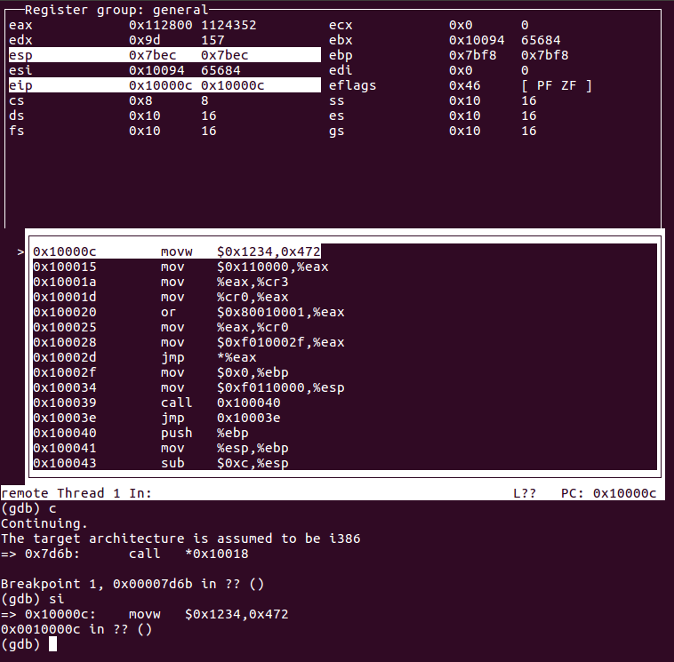
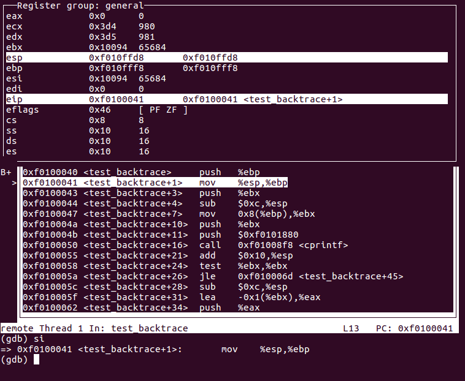

# Lab 1 Booting a PC

实验1分为三个部分

1. 熟悉x86汇编语言、QEMU模拟器、PC启动过程
2. boot loader,代码在目录boot下
3. 初始化的内核模板 JOS,代码在目录kernel下

## 准备

### 理论准备

MIT给出了预备知识的回顾

1. x86架构计算机结构 
   1. 笔记 https://pdos.csail.mit.edu/6.828/2018/lec/l-x86.html
   2. PPT https://pdos.csail.mit.edu/6.828/2018/lec/l-x86.pdf
2. x86汇编 https://pdos.csail.mit.edu/6.828/2018/readings/pcasm-book.pdf

### 软件准备

- Qemu https://pdos.csail.mit.edu/6.828/2018/tools.html#qemu
  - 可能会出现一些情况  参考 https://www.cnblogs.com/wuchanming/p/5008484.html
- 代码获取 https://pdos.csail.mit.edu/6.828/2018/labs/lab1/#Software-Setup

## Part 1 PC启动

### PC的物理地址空间

> 历史上第一个PC使用的是16位的8086处理器,本实验仿真的是80386处理器,该处理器32位,寻址空间2^32=4G

A PC's physical address space is **hard-wired** to have the following general layout:

```
+------------------+  <- 0xFFFFFFFF (4GB)
|      32-bit      |
|  memory mapped   |
|     devices      |
|                  |
/\/\/\/\/\/\/\/\/\/\

/\/\/\/\/\/\/\/\/\/\
|                  |
|      Unused      |
|                  |
+------------------+  <- depends on amount of RAM
|                  |
|                  |
| Extended Memory  |
|                  |
|                  |
+------------------+  <- 0x00100000 (1MB)
|     BIOS ROM     |
+------------------+  <- 0x000F0000 (960KB)
|  16-bit devices, |
|  expansion ROMs  |
+------------------+  <- 0x000C0000 (768KB)
|   VGA Display    |
+------------------+  <- 0x000A0000 (640KB)
|                  |
|    Low Memory    |
|                  |
+------------------+  <- 0x00000000
```

注意到
1. 并不是全部是RAM,BIOS就是ROM
2. 因为地址线有32根, 所以地址空间自然就是2^32=4G
3. 该地址空间是物理空间,全部都是通过电路硬编码组成的

#### 物理地址空间说明

低640k,Low Memory区域是早期PC唯一可以使用的RAM, 为了兼容所以就留了下来

紧接着的384k是为特殊用途的硬件留下来的物理地址空间, 比如说启动的BIOS或者显示屏的VGA

这384k的空间以一个洞的形式将RAM分成了两部分,Low Memory & Extended Memory

注意: 由于`JOS`设计的限制, 在之后所有关于`JOS`的`lab`中只使用前256M的物理内存.

### ROM BIOS

#### 什么是BIOS

> BIOS是处理器用于获取操作系统的一段程序,该程序可以被处理器访问,位于集成在PC内部的一个EPROM芯片中
>
> https://whatis.techtarget.com/definition/BIOS-basic-input-output-system

也就是说,一开始的主角是CPU+BIOS,CPU从BIOS中获取指令。

开两个终端,一个`make qemu-gdb` 另一个`make gdb`

得到

``` bash
athena% make gdb
GNU gdb (GDB) 6.8-debian
Copyright (C) 2008 Free Software Foundation, Inc.
License GPLv3+: GNU GPL version 3 or later <http://gnu.org/licenses/gpl.html>
This is free software: you are free to change and redistribute it.
There is NO WARRANTY, to the extent permitted by law.  Type "show copying"
and "show warranty" for details.
This GDB was configured as "i486-linux-gnu".
+ target remote localhost:26000
The target architecture is assumed to be i8086
[f000:fff0] 0xffff0:	ljmp   $0xf000,$0xe05b
0x0000fff0 in ?? ()
+ symbol-file obj/kern/kernel
(gdb) 
```

PC启动上电后执行的第一条指令

``` asm
[f000:fff0] 0xffff0:	ljmp   $0xf000,$0xe05b
```

可以得出一些信息：

- 第一条指令在BIOS内 ,BIOS有64k字节,该指令在BIOS区域的最后---倒数第16个字节
- PC开始执行：`CS = 0xf000` and `IP = 0xfff0`.
- 第一条指令做的是跳转,毕竟16个字节做不了什么

到此,都发生了什么呢？首先按下PC电源开机,此时还是裸机, 一堆硬板, 内存里面什么都没有, BIOS程序是硬编码在指定地址的, 按下电源后处理器`reset`, 进入`real mode`, 硬件程序设置`cs`和`ip`分别等于`0xf000`和`0xfff0`(硬编码),在该模式下得到物理地址`0xffff0`, 也就是BIOS的地盘. CPU开始取指、执行、取指……

- `real mode`参考[mode](../prepare/mode/book1.2.7)

- `ljump`指令,第一个参数是`cs`寄存器,第二个是`ip`寄存器得到的物理地址

#### BIOS的工作

- 建立**中断描述符表**

- 初始化各种device 比如VGA PCI bus

- 寻找可boot的device

- BIOS结束,进入disk中的boot loader

## Part 2 Boot Loader

当`BIOS`发现一个bootable的device的时候,将该device的第一个扇区`boot sector`的内容加载(从device到Low Memory)到物理地址`0x7c00--0x7dff`,使用`ljmp`指令跳到该地址(`0000:7c00`)后控制权由`BIOS`交接到`boot loader`(CPU的取指地方,也就是`cs`寄存器的变化),早期PC`boot loader`的最大512字节.

### Boot Loader的工作

`boot loader`的内容在`boot/boot.S`和`boot/main.c`中,`boot loader`主要完成了两件事

- 将处理器从`real mode`转为`protect mode`,简单来说,原来的地址空间只够1M(20 bits),现在可以到4G(32 bits)
- 加载`kernel`,后将控制权交给`kernel `

注意：可以参考`obj/boot/boot.sam`,源码反汇编形成的汇编代码

> 源码内有大量的注释,很多不懂地方的答案就在不想看的英文注释上。

### exercise 3

#### 问题1

> At what point does the processor start executing 32-bit code? 
> What exactly causes the switch from 16- to 32-bit mode?

首先在`boot loader`的第一个地址打断点,当执行`0x7c00`地址的指令时,暂停如下

``` bash
+ symbol-file kernel
(gdb) b *0x7c00
Breakpoint 1 at 0x7c00
(gdb) c
Continuing.
[   0:7c00] => 0x7c00:	cli    
```

`si`单步执行,按照源文件顺序

``` asm
  # Switch from real to protected mode, using a bootstrap GDT
  # and segment translation that makes virtual addresses 
  # identical to their physical addresses, so that the 
  # effective memory map does not change during the switch.
  lgdt    gdtdesc
  movl    %cr0, %eax
  orl     $CR0_PE_ON, %eax
  movl    %eax, %cr0
  
  # Jump to next instruction, but in 32-bit code segment.
  # Switches processor into 32-bit mode.
  ljmp    $PROT_MODE_CSEG, $protcseg
```

通过将`CR0`寄存器的`PE`置一,使保护模式使能,后通过`jmp`切换

``` asm
[   0:7c26] => 0x7c26:  or     $0x1,%eax
0x00007c26 in ?? ()
[   0:7c2a] => 0x7c2a:  mov    %eax,%cr0
0x00007c2a in ?? ()
[   0:7c2d] => 0x7c2d:  ljmp   $0x8,$0x7c32
0x00007c2d in ?? ()
The target architecture is assumed to be i386
=> 0x7c32:      mov    $0x10,%ax
0x00007c32 in ?? ()
(gdb) 

```

注意到`ljmp`指令执行后,地址标示发生了变化,进入了32位模式

#### 问题2

> What is the *last* instruction of the boot loader executed, and what is the *first* instruction of the kernel it just loaded?

通过反汇编文件得到`boot loader`最后一条指令

``` bash
// call the entry point from the ELF header
// note: does not return!
((void (*)(void)) (ELFHDR->e_entry))();
7d6b:	ff 15 18 00 01 00    	call   *0x10018
```

kernel第一条指令



注意到: boot loader 最后一条指令的地址是 `0x76db`在`Low Memory`中的`0x7c00-0x7dff`区域, 而`kernel`的地址就直接到了`Extend Memory`中

#### 问题3

> *Where* is the first instruction of the kernel?

上图可以看出第一个指令的地址是`0x10000c`

或者对`kernel`文件反汇编也得到

``` bash
(base) senzuo@senzuo:~/Documents/os/2018-6.828/lab/obj/kern$ objdump -x kernel

kernel:     file format elf32-i386
kernel
architecture: i386, flags 0x00000112:
EXEC_P, HAS_SYMS, D_PAGED
start address 0x0010000c
...
```

#### 问题4

> How does the boot loader decide how many sectors it must read in order to fetch the entire kernel from disk? 
> Where does it find this information?

- `elf.h`中定义了`main.c`用到的格式,源码中的`Elf`其实应该改为`elfhdr`,因为表示的是二进制可执行文件ELF的Header格式,类似的`Proghdr`表示的是程序段`section`的头格式
- `main.c`中ELFHDR 是一个指向`Elf`的指针,并且从头到尾该指针的值（地址）是不变的

``` cpp
void
bootmain(void)
{
	struct Proghdr *ph, *eph;

	// read 1st page off disk
	readseg((uint32_t) ELFHDR, SECTSIZE*8, 0); // 1

	// is this a valid ELF?
	if (ELFHDR->e_magic != ELF_MAGIC)
		goto bad;

	// load each program segment (ignores ph flags)
	ph = (struct Proghdr *) ((uint8_t *) ELFHDR + ELFHDR->e_phoff); // 2
	eph = ph + ELFHDR->e_phnum; // 3
	for (; ph < eph; ph++)
		// p_pa is the load address of this segment (as well
		// as the physical address)
		readseg(ph->p_pa, ph->p_memsz, ph->p_offset); // 4

	// call the entry point from the ELF header
	// note: does not return!
	((void (*)(void)) (ELFHDR->e_entry)) ();

bad:
	outw(0x8A00, 0x8A00);
	outw(0x8A00, 0x8E00);
	while (1)
		/* do nothing */;
}
```

源码中可以看出

- 1处实现的是往ELFHDR处读4k(page)内容,包括了ELF的Header和部分`section`信息
- 2处首先从ELF的Header拿到有几个加载的程序段,ELF的Header后紧邻着连续的程序段的Header,此处就将指针跳过自身(ELF Header),指向程序段Header开始的地址,而后强转为程序段的Header指针
- 3处得到程序段Header结束时的地址
- 4处每一个程序段Header都有该程序段的源地址和加载地址(LMA),此处分别加载每个段的内容到各自指定的地址

自此,内核加载完成,最后进入内核执行


### 加载kernel

#### ELF

为了搞清楚`boot/main.c`就要知道一些ELF的知识, ELF是在Linux系统上由C源文件通过编译得到一堆`.o`文件, 而后所有的obj文件链接得到**E**可执行**L**可链接**F**格式二进制文件。

##### Section

我们需要知道的就是该格式的文件头部是固定长度,有加载信息,之后是**不定长**的程序头, 程序头列表了每一个要加载的程序段, 程序段是一段连续的代码或者数据

kernel就是一种ELF文件, kernel中的几个section被`boot loader`加载到指定地址,然后执行。

几个重要的程序`section`

- `.text` 程序的执行指令

- `.rodata`只读数据 比如 ASCII 字符串常量

- `.data` 程序中的初始化数据 比如 全局变量

`.bss`未初始化的全局变量,由于默认是0,所以只记录地址和大小,当加载时候在占实际内存. 在ELF文件中是不保存数据的实际数据的.

查看所有`section`的名字, 大小, link地址等信息

``` bash
objdump -h obj/kern/kernel
// output
kernel:     file format elf32-i386

Sections:
Idx Name          Size      VMA       LMA       File off  Algn
  0 .text         00001971  f0100000  00100000  00001000  2**4
                  CONTENTS, ALLOC, LOAD, READONLY, CODE
  1 .rodata       00000748  f0101980  00101980  00002980  2**5
                  CONTENTS, ALLOC, LOAD, READONLY, DATA
  2 .stab         00004015  f01020c8  001020c8  000030c8  2**2
                  CONTENTS, ALLOC, LOAD, READONLY, DATA
  3 .stabstr      00001b6b  f01060dd  001060dd  000070dd  2**0
                  CONTENTS, ALLOC, LOAD, READONLY, DATA
  4 .data         0000a300  f0108000  00108000  00009000  2**12
                  CONTENTS, ALLOC, LOAD, DATA
  5 .bss          00000654  f0112300  00112300  00013300  2**5
                  CONTENTS, ALLOC, LOAD, DATA
  6 .comment      00000035  00000000  00000000  00013954  2**0

```

除了那三个列出来的段其他的都是用来debug的,甚至有的不加载到`kernel`中

##### VMA&LMA

特别注意`text`段的`VMA`(link addr)和`LMA`(load addr)	

- LMA(load addr)是`text`段应该加载到内存的内存地址
- VMA(link addr)是`text`段期望执行的内存地址,也就是虚拟地址

注意到`.text`的`VMA`和`LMA`部分,是不相同的,VMA在高位,LMA在低位

一般来说这两个地址是一样的,随便找个可执行文件`objdump -h`一下

``` bash
12 .plt.got      00000008  0000000000400710  0000000000400710  00000710  2**3
                  CONTENTS, ALLOC, LOAD, READONLY, CODE
 13 .text         00000272  0000000000400720  0000000000400720  00000720  2**4
                  CONTENTS, ALLOC, LOAD, READONLY, CODE
 14 .fini         00000009  0000000000400994  0000000000400994  00000994  2**2
```

查看boot的ELF可执行文件也是如此

``` cpp
(base) senzuo@senzuo:~/Documents/os/2018-6.828/lab$ objdump -h obj/boot/boot.out 
obj/boot/boot.out:     file format elf32-i386

Sections:
Idx Name          Size      VMA       LMA       File off  Algn
  0 .text         00000186  00007c00  00007c00  00000074  2**2
                  CONTENTS, ALLOC, LOAD, CODE
  1 .eh_frame     000000a8  00007d88  00007d88  000001fc  2**2
                  CONTENTS, ALLOC, LOAD, READONLY, DATA
  2 .stab         00000720  00000000  00000000  000002a4  2**2
                  CONTENTS, READONLY, DEBUGGING
  3 .stabstr      0000088f  00000000  00000000  000009c4  2**0
                  CONTENTS, READONLY, DEBUGGING
  4 .comment      00000035  00000000  00000000  00001253  2**0
                  CONTENTS, READONLY
```


ELF程序Header指定哪些部分加载到内存以及加载到哪里,通过命令`objdump -x kernel`查看

``` bash
...
Program Header:
    LOAD off    0x00001000 vaddr 0xf0100000 paddr 0x00100000 align 2**12
         filesz 0x00007c48 memsz 0x00007c48 flags r-x
    LOAD off    0x00009000 vaddr 0xf0108000 paddr 0x00108000 align 2**12
         filesz 0x0000a954 memsz 0x0000a954 flags rw-
   STACK off    0x00000000 vaddr 0x00000000 paddr 0x00000000 align 2**4
         filesz 0x00000000 memsz 0x00000000 flags rwx
...
```

`LOAD`表示加载到内存中,还可以看出每个段的其他信息,虚拟地址vddr,物理地址pddr,文件大小等等,正好和代码中的一一对应

``` C
struct Proghdr {
	uint32_t p_type;
	uint32_t p_offset;
	uint32_t p_va;
	uint32_t p_pa;
	uint32_t p_filesz;
	uint32_t p_memsz;
	uint32_t p_flags;
	uint32_t p_align;
};
```

那回到`kernel`文件,为什么两个地址不同呢?因为内核想要加载到低地址(1 M),但是在高地址执行,下一节讨论.

##### entry

之前的link address都是在段Header中,entry是保存在ELF Header中的link address,`e_entry`,指定程序应该从哪里开始执行

``` bash
$ objdump -f obj/kern/kernel
obj/kern/kernel:     file format elf32-i386
architecture: i386, flags 0x00000112:
EXEC_P, HAS_SYMS, D_PAGED
start address 0x0010000c
```

现在就完全理解`boot/main.c`了!

### 记录

#### 一行神奇的代码

``` c
((void (*)(void)) (ELFHDR->e_entry)) ();
```

这行代码可以分成三部分

- `((void (*)(void)) `
- `(ELFHDR->e_entry)) `
- `();`

第二部分就是一个表达式,结合代码返回的是一个`uint32_t`类型的数据,第一部分比较复杂,是一个函数指针,该函数没有参数没有返回类型.

第一部分 对第二部分来说是强转,将`unit32`类型的数据转换成一个函数指针

第三部分就是通过函数指针的一次调用

那么那个函数是什么呢 :smile:

这段代码翻译成汇编就是 call   *0x10018 
0x10018就是entry的地址,里面存的就是入口0x10000C
所以实际上是 call   0x10000C

所以虽然说是函数指针调用,但是实际上就是进入本来就程序入口而已,没有所谓的函数体


#### 其他

一开始ELF的Header要加载的地址是`0x10000`,和ELF 加载section的`0x100000`是不一样的, 一个在`Low Memory`一个在`Extend Memory` 


## Part 3 Kernel

第三部分稍微深入一点查看`kernel`,和`boot loader`类似,`kernel`以一些汇编代码开始,为之后的C代码做准备,使得C代码正确地执行.

### 虚拟内存初探

操作系统kernel喜欢链接和运行在很高的虚拟地址,上文中的`0x0f0100000`,这样可以腾出地地址空间给用户进程使用,详细情况在下一个Lab说明.

kernel加载在物理地址`0x100000`也就是1M点,BIOS上,link(运行)在高地址(`0xf0100000`)处. 然而事实上,很多机器没有那么高的物理地址,采用了处理器的**内存管理硬件**映射高的虚拟地址到低的物理地址

本实验中,先尝试使用手写的静态初始化的page(`kern/entrypgdir.c`)来映射物理地址的前`4M`
**现在,不必了解其工作原理的细节，只需了解其实现的效果。**

在程序执行时,CPU持有的当前要执行的指令地址,但是指令在不同情况下会有不同的解释方式

1. CPU持有的地址被当做物理地址直接访问
2. CPU持有的地址经过**内存管理硬件**翻译成虚拟地址

这两种模式取决于CPU中的控制寄存器`CR)_PG`是否`set`,当`clear`时,就是第一种情况,否则就是第二种情况.

#### exercise 7

> Use QEMU and GDB to trace into the JOS kernel and stop at the `movl %eax, %cr0`.  Examine memory
> at 0x00100000 and at 0xf0100000.  Now, single step over that  instruction using the stepi GDB command.  Again, examine memory at 0x00100000 and at 0xf0100000.  Make sure you understand what just happened.

完整过程记录如下

1. 在kernel入口`0x10000C`打断点
2. `si`单步执行到指令`%eax,%cr0` 打开page停止
3. 使用`x/8x 0x100000`和`x/8x 0xf0100000`查看两个地址的内容

发现

- 原本因为地址线不够的原因访问不到高地址的处理器,可以访问到了高地址
- 两个地址(虚拟地址,因为开启了`CR0_PG`)的内容是一样的,因为将两个虚拟地址映射到了一个物理地址.

``` bash
(gdb) b *0x10000c
Breakpoint 1 at 0x10000c
(gdb) c
Continuing.
The target architecture is assumed to be i386
=> 0x10000c:	movw   $0x1234,0x472

Breakpoint 1, 0x0010000c in ?? ()
(gdb) si
=> 0x100015:	mov    $0x110000,%eax
0x00100015 in ?? ()
(gdb) 
=> 0x10001a:	mov    %eax,%cr3
0x0010001a in ?? ()
(gdb) 
=> 0x10001d:	mov    %cr0,%eax
0x0010001d in ?? ()
(gdb) 
=> 0x100020:	or     $0x80010001,%eax
0x00100020 in ?? ()
(gdb) 
=> 0x100025:	mov    %eax,%cr0
0x00100025 in ?? ()
(gdb) 
=> 0x100028:	mov    $0xf010002f,%eax
0x00100028 in ?? ()
(gdb) x/8x 0x100000
0x100000:	0x1badb002	0x00000000	0xe4524ffe	0x7205c766
0x100010:	0x34000004	0x0000b812	0x220f0011	0xc0200fd8
(gdb) x/8x 0xf0100000
0xf0100000 <_start+4026531828>:	0x1badb002	0x00000000	0xe4524ffe	0x7205c766
0xf0100010 <entry+4>:	0x34000004	0x0000b812	0x220f0011	0xc0200fd8
(gdb) 
```

### 格式化打印控制台

`printf`并不是C语言本身的范畴,这个函数是要我们自己动手实现的.

实现涉及到三个文件`kern/printf.c`, `lib/printfmt.c`,和 `kern/console.c`,通过下面的问题来看代码是个好的办法.

#### exercise 8

> We have omitted a small fragment of code -the code necessary to print octal numbers
> using patterns of the form "%o". Find and fill in this code fragment.

在文件`lib/printfmt.c`中参考16进制的写法,可以很容易的得到8进制的代码

``` c
// (unsigned) hexadecimal
		case 'x':
			num = getuint(&ap, lflag);
			base = 8;
		// (unsigned) hexadecimal
case 'x':
	num = getuint(&ap, lflag);
	base = 16;
number:
	printnum(putch, putdat, num, base, width, padc);
	break;
```


#### 问题

##### 1 

> Explain the interface between `printf.c` and `console.c`.  Specifically, what function does
> `console.c` export?  How is this function used by `printf.c`?

`console.c`实际上导出了`cputchar`函数供`prinf.c`使用

``` C
static void
putch(int ch, int *cnt)
{
	cputchar(ch);
	*cnt++;
}
```

##### 2

> Explain the following from `console.c`:
>
> ``` c
> 1 if (crt_pos >= CRT_SIZE) {
> 2 	int i;
> 3     memmove(crt_buf, crt_buf + CRT_COLS, (CRT_SIZE - CRT_COLS) * sizeof(uint16_t));
> 4     for (i = CRT_SIZE - CRT_COLS; i < CRT_SIZE; i++)
> 5         crt_buf[i] = 0x0700 | ' ';
> 6     crt_pos -= CRT_COLS;
> 7 }
> ```
>

实际上挺简单的，crt_pos表示的是屏幕上光标的位置，而CRT_SIZE是指整个屏幕的大小

如果发现当前已经把整个屏幕写满了，就把从第2行到最后一行的内容全部移动到从第一行到倒数第二行，然后最后一行清空，重新写

其他的跳过:baby_symbol:

### Stack

最后一部分,学习在`x86`架构上C语言使用stack的细节,并且写一个函数打印stack的 *backtrace*

前提是要知道基础的栈结构, 具体可以查看[栈帧结构](./prepare/stack.md)


***

#### Exercise 9.
> Determine where the kernel initializes its stack, and exactly where in memory its stack is located.
> How does the kernel reserve space for its stack? And at which "end" of this reserved area is the stack pointer initialized to point to?

``` bash
(gdb) 
=> 0xf010002f <relocated>:	mov    $0x0,%ebp
relocated () at kern/entry.S:74
74		movl	$0x0,%ebp			# nuke frame pointer
(gdb) 
=> 0xf0100034 <relocated+5>:	mov    $0xf0110000,%esp
relocated () at kern/entry.S:77
77		movl	$(bootstacktop),%esp
(gdb) 
```

首先, 从调试中的细节可以看出,`kern/entry.S:74`开始初始化栈的结构,注释中的`nuke`太吓人了;`kern/entry.S:77`将`esp`指向了`0xf0110000`就是上图中的最下面的指针,这一行也决定了栈在那个地址(虚拟地址),占了多少空间

#### Exercise 10

> To become familiar with the C calling conventions on the x86, find the address of the `test_backtrace` function in `obj/kern/kernel.asm`, set a breakpoint there
>
> 1. examine what happens each time it gets called after the kernel starts.
> 2. How many 32-bit words does each recursive nesting level of `test_backtrace` push on the stack
> 3.  what are those words?

函数在`kern/init.c`文件中, 是个递归调用函数

``` c
void
test_backtrace(int x)
{
	cprintf("entering test_backtrace %d\n", x);
	if (x > 0)
		test_backtrace(x-1);
	else
		mon_backtrace(0, 0, 0);
	cprintf("leaving test_backtrace %d\n", x);
}

```

在第一次进入该函数的时候, `ebp`所指的值就是特殊值`0x00000000`


1. 如图,每次调用都会执行前几个指令

   1. 保存`bp`指针
   2. 新的`bp`就指向当前
   3. 栈扩展空间,就是图中的第四个减法指令

   

2. 每次调用`sp`都会减去`0xc`,也就是分配12个字节

3. 这些字节用来保存调用函数的变量

> 关于栈的有用的gdb命令
>
> 1. info frame 当前栈帧信息
> 2. info args 当前栈的参数

#### Exercise 11

> Implement the backtrace function as specified above. Use the same format as in the example, since otherwise the grading script will be confused. When you think you have it working right, run make grade to see if its output conforms to what our grading script expects, and fix it if it doesn't. *After* you have handed in your Lab 1 code, you are welcome to change the output format of the backtrace function any way you like. 

同样是考察堆栈结构,堆栈有一个特点,就是当前`ebp`所指的内容就是之前调用函数所使用的`ebp`,所以一层层(一条条指令)的直接指向到根,那个根也就是加载kernel时候设置的`ebp`为0

在加上给出来的函数`read_ebp`,编写这个程序也就不是那么难了

``` C
int
mon_backtrace(int argc, char **argv, struct Trapframe *tf)
{
	uint32_t *ebp;
    ebp = (uint32_t *)read_ebp();
    cprintf("Stack backtrace:\r\n");
    while (ebp)
    {
        cprintf("  ebp %08x  eip %08x  args %08x %08x %08x %08x %08x\r\n", 
                ebp, ebp[1], ebp[2], ebp[3], ebp[4], ebp[5], ebp[6]);
        ebp = (uint32_t *)*ebp;
    }
	// Your code here.
	return 0;
}
```

重新编译,内核初始化自动指向,得到的效果如下

``` bash
Stack backtrace:
  ebp f010ff18  eip f010007b  args 00000000 00000000 00000000 00000000 f01008fd
  ebp f010ff38  eip f0100068  args 00000000 00000001 f010ff78 00000000 f01008fd
  ebp f010ff58  eip f0100068  args 00000001 00000002 f010ff98 00000000 f01008fd
  ebp f010ff78  eip f0100068  args 00000002 00000003 f010ffb8 00000000 f01008fd
  ebp f010ff98  eip f0100068  args 00000003 00000004 00000000 00000000 00000000
  ebp f010ffb8  eip f0100068  args 00000004 00000005 00000000 00010094 00010094
  ebp f010ffd8  eip f01000d4  args 00000005 00001aac 00000640 00000000 00000000
  ebp f010fff8  eip f010003e  args 00111021 00000000 00000000 00000000 00000000
```

#### Exercise 12

> Modify your stack backtrace function to display, for each `eip`, the function name, source file name, and line number corresponding to that `eip`.

给出了一个函数`debuginfo_eip()`,该函数在符号表查找`eip`返回该地址的`debug`信息

使用该函数即可

``` C
int
mon_backtrace(int argc, char **argv, struct Trapframe *tf)
{
	uint32_t *ebp;
	struct Eipdebuginfo info;
    int result;

    ebp = (uint32_t *)read_ebp();
    cprintf("Stack backtrace:\r\n");

    while (ebp) {
        cprintf("  ebp %08x  eip %08x  args %08x %08x %08x %08x %08x\r\n", 
                ebp, ebp[1], ebp[2], ebp[3], ebp[4], ebp[5], ebp[6]);
        memset(&info, 0, sizeof(struct Eipdebuginfo));
        result = debuginfo_eip(ebp[1], &info);
        if (0 != result) {
            cprintf("failed to get debuginfo for eip %x.\r\n", ebp[1]);
        } else {
            cprintf("\t%s:%d: %.*s+%u\r\n", info.eip_file, info.eip_line, info.eip_fn_namelen, info.eip_fn_name, ebp[1] - info.eip_fn_addr);
        }
        ebp = (uint32_t *)*ebp;
    }
	// Your code here.
	return 0;
}
```


## 参考

https://pdos.csail.mit.edu/6.828/2018/labs/lab1/

https://www.cnblogs.com/bdhmwz/p/4922486.html

https://www.cnblogs.com/wuhualong/tag/6.828/