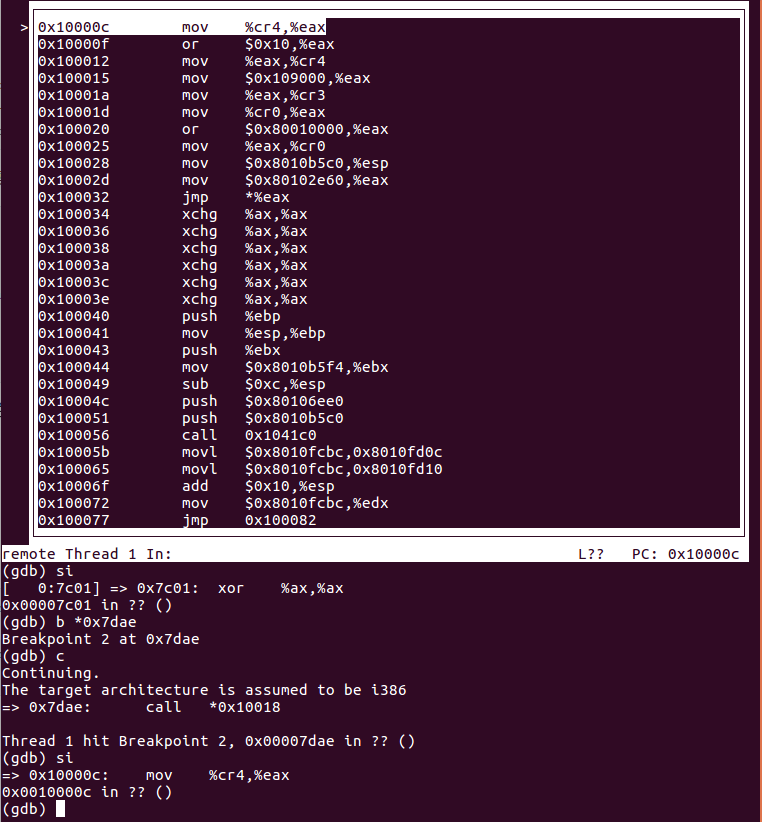

# lab 1 Booting a PC

实验1分为三个部分

1. 熟悉x86汇编语言、QEMU模拟器、PC启动过程
2. boot loader,代码在目录boot下
3. 初始化的内核模板 JOS,代码在目录kernel下

## 软件准备

oass

## Part 1 PC启动

### 熟悉x86汇编

> https://pdos.csail.mit.edu/6.828/2018/readings/pcasm-book.pdf
>
> 汇编器有两种：NASM、GNU；其中NASM使用Intel格式,GNU采用AT&T格式


### PC的物理地址空间

> 第一个PC使用的是16位的8086处理器,仿真的是80386处理器,该处理器32位,寻址空间2^32=4G

A PC's physical address space is hard-wired to have the following general layout:

```
+------------------+  <- 0xFFFFFFFF (4GB)
|      32-bit      |
|  memory mapped   |
|     devices      |
|                  |
/\/\/\/\/\/\/\/\/\/\

/\/\/\/\/\/\/\/\/\/\
|                  |
|      Unused      |
|                  |
+------------------+  <- depends on amount of RAM
|                  |
|                  |
| Extended Memory  |
|                  |
|                  |
+------------------+  <- 0x00100000 (1MB)
|     BIOS ROM     |
+------------------+  <- 0x000F0000 (960KB)
|  16-bit devices, |
|  expansion ROMs  |
+------------------+  <- 0x000C0000 (768KB)
|   VGA Display    |
+------------------+  <- 0x000A0000 (640KB)
|                  |
|    Low Memory    |
|                  |
+------------------+  <- 0x00000000
```

> 注意到并不是全部是RAM,BIOS就是ROM
> BIOS不是一个芯片吗？还是说内存条的地址不是从零开始的？
>
> 按照图中的意思,内存条也就是RAM是从1M开始的,Extended Memory区域就是内存条的区域,其他的区域由别的设备使用或者空闲。

### ROM BIOS

#### 什么是BIOS

> BIOS是处理器用于获取操作系统的一段程序,该程序可以被处理器访问,位于集成在PC内部的一个EPROM芯片中
>
> https://whatis.techtarget.com/definition/BIOS-basic-input-output-system

也就是说,一开始的主角是CPU+BIOS,CPU从BIOS中获取指令。

开两个终端,一个`make qemu-gdb` 另一个`make gdb`

得到

``` bash
athena% make gdb
GNU gdb (GDB) 6.8-debian
Copyright (C) 2008 Free Software Foundation, Inc.
License GPLv3+: GNU GPL version 3 or later <http://gnu.org/licenses/gpl.html>
This is free software: you are free to change and redistribute it.
There is NO WARRANTY, to the extent permitted by law.  Type "show copying"
and "show warranty" for details.
This GDB was configured as "i486-linux-gnu".
+ target remote localhost:26000
The target architecture is assumed to be i8086
[f000:fff0] 0xffff0:	ljmp   $0xf000,$0xe05b
0x0000fff0 in ?? ()
+ symbol-file obj/kern/kernel
(gdb) 
```

PC启动上电后执行的第一条指令

``` asm
[f000:fff0] 0xffff0:	ljmp   $0xf000,$0xe05b
```

注意到：

- 第一条指令在BIOS内 ,BIOS有64k字节,该指令在BIOS区域最前面倒数第16个字节
- PC开始执行：`CS = 0xf000` and `IP = 0xfff0`.
- 第一条指令做的是跳转,毕竟16个字节做不了什么

到此,都发生了什么呢？首先按下PC电源开机,此时还是裸机,内存里面什么都没有,BIOS程序是硬编码在指定地址的,按下电源后处理器`reset`,进入`real mode`,设置`cs`和`ip`分别等于`0xf000`和`0xfff0`,在该模式下得到物理地址`0xffff0`,也就是BIOS的地盘。CPU开始取指、执行、取指……

- `real mode`参考[mode](../prepare/mode/book1.2.7)

- `ljump`指令,第一个参数是`cs`寄存器,第二个是`ip`寄存器得到的物理地址

  

#### BIOS的工作

- 建立**中断描述符表**

- 初始化各种device 比如VGA PCI bus

- 寻找可boot的device

- BIOS结束,进入disk中的boot loader

## Part 2 Boot Loader

当`BIOS`发现一个bootable的device的时候,将该device的第一个扇区`boot sector`的内容加载(从device到Low Memory)到地址`0x7c00--0x7dff`,使用`ljmp`指令跳到该地址(`0000:7c00`)后控制权由`BIOS`交接到`boot loader`(CPU的取指地方的变化),`boot loader`的最大512Byte（早期PC）

### Boot Loader的工作

`boot loader`的内容在`boot/boot.S`和`boot/main.c`中,`boot loader`主要完成了两件事

- 处理器从`real mode`转为`protect mode`,简单来说,原来的地址空间只够1M(20 bits),现在可以到4G(32 bits)
- 加载`kernel`,后将控制权交给`kernel `

注意：可以参考`obj/boot/boot.sam`,源码反汇编形成的汇编代码

> 源码内有大量的注释,很多不懂地方的答案就在不想看的英文注释上。

### exercise 3

#### 问题1

> At what point does the processor start executing 32-bit code? 
> What exactly causes the switch from 16- to 32-bit mode?

首先在`boot loader`的第一个地址打断点,当执行`0x7c00`地址的指令时,暂停如下

``` bash
+ symbol-file kernel
(gdb) b *0x7c00
Breakpoint 1 at 0x7c00
(gdb) c
Continuing.
[   0:7c00] => 0x7c00:	cli    
```

`si`单步执行,按照源文件顺序

``` asm
  # Switch from real to protected mode, using a bootstrap GDT
  # and segment translation that makes virtual addresses 
  # identical to their physical addresses, so that the 
  # effective memory map does not change during the switch.
  lgdt    gdtdesc
  movl    %cr0, %eax
  orl     $CR0_PE_ON, %eax
  movl    %eax, %cr0
  
  # Jump to next instruction, but in 32-bit code segment.
  # Switches processor into 32-bit mode.
  ljmp    $PROT_MODE_CSEG, $protcseg
```

通过将`CR0`寄存器的`PE`置一,使保护模式使能,后通过`jmp`切换

``` asm
[   0:7c2c] => 0x7c2c:	ljmp   $0x8,$0x7c31
0x00007c2c in ?? ()
(gdb) 
The target architecture is assumed to be i386
=> 0x7c31:	mov    $0x10,%ax
0x00007c31 in ?? ()
(gdb) 
```

注意到`ljmp`指令执行后,地址标示发生了变化,进入了32位模式

#### 问题2

> What is the *last* instruction of the boot loader executed, and what is the *first* instruction of the kernel it just loaded?

`boot loader`最后一条指令

``` bash
// call the entry point from the ELF header
// note: does not return!
((void (*)(void)) (ELFHDR->e_entry))();
7d6b:	ff 15 18 00 01 00    	call   *0x10018
```

kernel第一条指令



#### 问题3

> *Where* is the first instruction of the kernel?

上图可以看出第一个指令的地址是`0x10000c`

或者对`kernel`文件反汇编得到

``` bash
(base) senzuo@senzuo:~/Documents/os/2018-6.828/lab/obj/kern$ objdump -x kernel

kernel:     file format elf32-i386
kernel
architecture: i386, flags 0x00000112:
EXEC_P, HAS_SYMS, D_PAGED
start address 0x0010000c
...
```

#### 问题4

> How does the boot loader decide how many sectors it must read in order to fetch the entire kernel from disk? 
> Where does it find this information?

- `elf.h`中定义了`main.c`用到的格式,源码中的`Elf`其实应该改为`elfhdr`,因为表示的是二进制可执行文件ELF的Header格式,类似的`Proghdr`表示的是程序段`section`的头格式
- `main.c`中ELFHDR 是一个指向`Elf`的指针,并且从头到尾该指针的值（地址）是不变的

``` cpp
void
bootmain(void)
{
	struct Proghdr *ph, *eph;

	// read 1st page off disk
	readseg((uint32_t) ELFHDR, SECTSIZE*8, 0); // 1

	// is this a valid ELF?
	if (ELFHDR->e_magic != ELF_MAGIC)
		goto bad;

	// load each program segment (ignores ph flags)
	ph = (struct Proghdr *) ((uint8_t *) ELFHDR + ELFHDR->e_phoff); // 2
	eph = ph + ELFHDR->e_phnum; // 3
	for (; ph < eph; ph++)
		// p_pa is the load address of this segment (as well
		// as the physical address)
		readseg(ph->p_pa, ph->p_memsz, ph->p_offset); // 4

	// call the entry point from the ELF header
	// note: does not return!
	((void (*)(void)) (ELFHDR->e_entry)) ();

bad:
	outw(0x8A00, 0x8A00);
	outw(0x8A00, 0x8E00);
	while (1)
		/* do nothing */;
}
```

源码中可以看出

- 1处实现的是往ELFHDR处读4k,page内容,包括了ELF的Header和部分`section`信息
- 2处首先从ELF的Header拿到有几个加载的程序段,ELF的Header后紧邻着连续的程序段的Header,此处就将指针跳过自身(ELF Header),指向程序段Header开始的地址,而后强转为程序段的Header指针
- 3处得到程序段Header结束时的地址
- 4处每一个程序段Header都有该程序段的源地址和加载地址(LMA),此处分别加载每个段的内容到各自指定的地址

自此,内核加载完成,最后进入内核执行


### 加载kernel

#### ELF

为了搞清楚`boot/main.c`就要知道一些ELF的知识,ELF是在Linux系统上由C源文件通过编译得到一堆`.o`文件,而后obj文件链接得到的**E**可执行**L**可链接**F**格式二进制文件。

##### Section

我们需要知道的就是该格式的文件头部是固定长度,有加载信息,之后是**不定长**的几个程序段,每一个程序段都是一段连续的代码或者数据,kernel就是一种ELF文件,被`boot loader`加载到指定地址,然后执行。

几个重要的程序`section`

- `.text` 程序的执行指令

- `.rodata`只读数据 比如 ASCII 字符串常量

- `.data` 程序中的初始化数据 比如 全局变量

`.bss`未初始化的全局变量,由于默认是0,所以只记录地址和大小,当加载时候在占实际内存. 在ELF文件中是不保存数据的实际数据的.

查看所有`section`的名字, 大小, link地址等信息

``` bash
objdump -h obj/kern/kernel
// output
kernel:     file format elf32-i386

Sections:
Idx Name          Size      VMA       LMA       File off  Algn
  0 .text         00001971  f0100000  00100000  00001000  2**4
                  CONTENTS, ALLOC, LOAD, READONLY, CODE
  1 .rodata       00000748  f0101980  00101980  00002980  2**5
                  CONTENTS, ALLOC, LOAD, READONLY, DATA
  2 .stab         00004015  f01020c8  001020c8  000030c8  2**2
                  CONTENTS, ALLOC, LOAD, READONLY, DATA
  3 .stabstr      00001b6b  f01060dd  001060dd  000070dd  2**0
                  CONTENTS, ALLOC, LOAD, READONLY, DATA
  4 .data         0000a300  f0108000  00108000  00009000  2**12
                  CONTENTS, ALLOC, LOAD, DATA
  5 .bss          00000654  f0112300  00112300  00013300  2**5
                  CONTENTS, ALLOC, LOAD, DATA
  6 .comment      00000035  00000000  00000000  00013954  2**0

```

除了那三个列出来的段其他的都是用来debug的,甚至有的不加载到`kernel`中

##### VMA&LMA

特别注意`text`段的`VMA`(link addr)和`LMA`(load addr)	

- LMA(load addr)是`text`段应该加载到内存的内存地址
- VMA(link addr)是`text`段期望执行的内存地址,也就是虚拟地址

注意到`.text`的`VMA`和`LMA`部分,是不相同的,VMA在高位,LMA在低位

一般来说这两个地址是一样的,随便找个可执行文件`objdump -h`一下

``` bash
12 .plt.got      00000008  0000000000400710  0000000000400710  00000710  2**3
                  CONTENTS, ALLOC, LOAD, READONLY, CODE
 13 .text         00000272  0000000000400720  0000000000400720  00000720  2**4
                  CONTENTS, ALLOC, LOAD, READONLY, CODE
 14 .fini         00000009  0000000000400994  0000000000400994  00000994  2**2
```

查看boot的ELF可执行文件也是如此

``` cpp
(base) senzuo@senzuo:~/Documents/os/2018-6.828/lab$ objdump -h obj/boot/boot.out 
obj/boot/boot.out:     file format elf32-i386

Sections:
Idx Name          Size      VMA       LMA       File off  Algn
  0 .text         00000186  00007c00  00007c00  00000074  2**2
                  CONTENTS, ALLOC, LOAD, CODE
  1 .eh_frame     000000a8  00007d88  00007d88  000001fc  2**2
                  CONTENTS, ALLOC, LOAD, READONLY, DATA
  2 .stab         00000720  00000000  00000000  000002a4  2**2
                  CONTENTS, READONLY, DEBUGGING
  3 .stabstr      0000088f  00000000  00000000  000009c4  2**0
                  CONTENTS, READONLY, DEBUGGING
  4 .comment      00000035  00000000  00000000  00001253  2**0
                  CONTENTS, READONLY
```


ELF程序Header指定哪些部分加载到内存以及加载到哪里,通过命令`objdump -x kernel`查看

``` bash
...
Program Header:
    LOAD off    0x00001000 vaddr 0xf0100000 paddr 0x00100000 align 2**12
         filesz 0x00007c48 memsz 0x00007c48 flags r-x
    LOAD off    0x00009000 vaddr 0xf0108000 paddr 0x00108000 align 2**12
         filesz 0x0000a954 memsz 0x0000a954 flags rw-
   STACK off    0x00000000 vaddr 0x00000000 paddr 0x00000000 align 2**4
         filesz 0x00000000 memsz 0x00000000 flags rwx
...
```

`LOAD`表示加载到内存中,还可以看出每个段的其他信息,虚拟地址vddr,物理地址pddr,文件大小等等,正好和代码中的一一对应

``` C
struct Proghdr {
	uint32_t p_type;
	uint32_t p_offset;
	uint32_t p_va;
	uint32_t p_pa;
	uint32_t p_filesz;
	uint32_t p_memsz;
	uint32_t p_flags;
	uint32_t p_align;
};
```

那回到`kernel`文件,为什么两个地址不同呢?因为内核想要加载到低地址(1 M),但是在高地址执行,下一节讨论.

##### entry

之前的link address都是在段Header中,entry是保存在ELF Header中的link address,`e_entry`,指定程序应该从哪里开始执行

``` bash
$ objdump -f obj/kern/kernel
obj/kern/kernel:     file format elf32-i386
architecture: i386, flags 0x00000112:
EXEC_P, HAS_SYMS, D_PAGED
start address 0x0010000c
```

现在就完全理解`boot/main.c`了!

### 记录

#### 一行神奇的代码

``` c
((void (*)(void)) (ELFHDR->e_entry)) ();
```

这行代码可以分成三部分

- `((void (*)(void)) `
- `(ELFHDR->e_entry)) `
- `();`

第二部分就是一个表达式,结合代码返回的是一个`uint32_t`类型的数据,第一部分比较复杂,是一个函数指针,该函数没有参数没有返回类型.

第一部分 对第二部分来说是强转,将`unit32`类型的数据转换成一个函数指针

第三部分就是通过函数指针的一次调用

那么那个函数是什么呢 :smile:


#### 其他

一开始ELF的Header要加载的地址是`0x10000`,和ELF文件的`0x100000`对不上,我以为是线性一个一个的连续加载.后来才发现自己理解的不对.